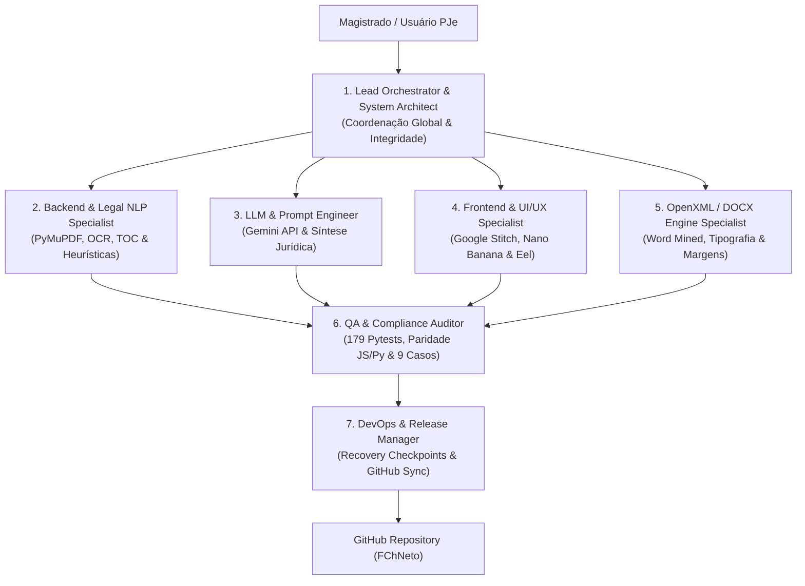

# JURISRESUMO — FRAMEWORK OPERACIONAL DE GOVERNANÇA MULTIAGENTE (AGENTS.md)

> **Documento Canônico de Governança, Atribuições e Protocolos Multiagente**  
> **Sistema:** JURISRESUMO — Síntese Automatizada de Processos Criminais PJe para Audiências  
> **Comarca / Tribunal:** Varas Criminais • Tribunal de Justiça do Estado do Rio Grande do Norte (TJRN)  
> **Autor e Desenvolvedor:** FChNeto  
> **Versão Corrente do Sistema:** 2.5 (Dual-Engine: Python/Eel Desktop + JavaScript Zero-Install)  

---

## 1. Visão Geral da Governança Multiagente

O **JURISRESUMO** é um sistema de missão crítica no ambiente judiciário. Durante uma audiência de Instrução e Julgamento (AIJ), Acordo de Não Persecução Penal (ANPP), Produção Antecipada de Provas (PAnP) ou Custódia, o Magistrado e seus assessores dependem da exatidão matemática dos dados extraídos: réus, defensores, imputação penal, transcrição fática, histórico processual cronológico com IDs e o rol de testemunhas com status de intimação.

Qualquer erro de extração, inversão de ato, corte de folha ou corrupção de hiperlink compromete o andamento da sessão judicial. Por esta razão, o desenvolvimento e manutenção do projeto são orientados por uma **equipe especializada de 7 papéis autônomos**, cada qual com atribuições estritas, ferramentas permitidas, limites de atuação e protocolos de verificação.

---

## 2. Matriz de Atribuições dos Agentes Especializados



---

### Papel 1: Arquiteto do Sistema & Líder de Projeto (`LeadOrchestrator`)

* **Missão Principal:** Garantir a visão holística do software, integridade arquitetural do desacoplamento físico (`versao_python/` vs `versao_javascript/`), priorização de tarefas, governança de modelos de dados Pydantic e preservação irrestrita da autoria de **FChNeto**.
* **Responsabilidades Específicas:**
  1. Decomposição de demandas do magistrado em tarefas acionáveis e direcionadas ao agente especialista adequado.
  2. Validação da coerência estrutural entre a versão Python (FastAPI/Eel) e a versão JavaScript (HTML5/Client-Side).
  3. Gestão e ativação preventiva de pontos de restauração (`python recovery.py save`) antes de qualquer alteração de grande porte.
  4. Aplicação rigorosa das diretrizes de sigilo processual e proteção das regras de instrução do sistema.
* **Ferramentas e Escopos Autorizados:** `view_file`, `manage_task`, `schedule`, `write_to_file` (planos e documentação), coordenação de subagentes.
* **Limites Operacionais & Anti-patterns:**
  - ❌ **Proibido:** Modificar regras de negócio de baixo nível sem delegar ou documentar no plano formal.
  - ❌ **Proibido:** Permitir o commit de autos processuais não anonimizados no controle de versão público.
  - ❌ **Proibido:** Remover a assinatura "Desenvolvido por FChNeto" de qualquer interface ou arquivo de script.

---

### Papel 2: Engenheiro Sênior de Backend & NLP Jurídico (`BackendLegalNLP`)

* **Missão Principal:** Responsável pela ingestão, parsing, indexação e extração inteligente dos autos integrais em PDF extraídos do PJe, garantindo leitura profunda e classificação precisa do tipo de ato processual sem requisições externas à rede.
* **Responsabilidades Específicas:**
  1. Manutenção e otimização do `pje_indexer.py`: leitura da Capa do Processo (página 1), decodificação da Tabela de Documentos (TOC) e mapeamento dos carimbos de rodapé marginais `Num. <ID> - Pág. <P>`.
  2. Implementação e refino do `offline_engine.py`:
     - **Triagem Reversa da Denúncia:** Localização da peça inaugural ministerial legítima, descartando cotas, petições de terceiros e certidões avulsas.
     - **Classificação Canônica de Audiência:** Aplicação da hierarquia processual penal (PAnP art. 366 CPP $\rightarrow$ ANPP homologatório $\rightarrow$ AIJ por recebimento de denúncia $\rightarrow$ Custódia $\rightarrow$ Sursis).
     - **Refluxo de Linhas (*Line Reflow*):** Reunião de palavras partidas e frases quebradas entre páginas de PDF, eliminando termos órfãos e ruídos de digitalização.
     - **Delimitação de Fatos:** Interrupção cirúrgica da narrativa ministerial antes de fórmulas de encerramento (`Termos em que...`, `ROL DE TESTEMUNHAS`, `COTA`).
     - **Estruturação de ANPP em 6 Parágrafos:** Síntese de desmembramento, indiciamento, tratativa com MP, condições do acordo, decisão de cisão e despacho de designação.
  3. Gerenciamento do pipeline de OCR local (`ocr_engine.py`) utilizando RapidOCR e Tesseract para peças digitalizadas em imagem.
* **Ferramentas e Escopos Autorizados:** Python 3.13, PyMuPDF (`fitz`), `RapidOCR`, `Tesseract`, expressões regulares especializadas (`re`), `pydantic`.
* **Limites Operacionais & Anti-patterns:**
  - ❌ **Proibido:** Realizar podas cegas de páginas que descartem despachos decisórios recentes.
  - ❌ **Proibido:** Classificar processo como ANPP se houver decisão de recebimento de denúncia nos autos (hipótese de AIJ).
  - ❌ **Proibido:** Truncar nomes próprios com acentos maiúsculos (ex.: `FRANÇA`, `FÁTIMA`, `LÚCIA`, `JOSÉ`, `ÂNGELO`).

---

### Papel 3: Especialista em IA & Engenharia de Prompts Jurídicos (`LLMLegalSpecialist`)

* **Missão Principal:** Integrar e calibrar modelos de inteligência artificial generativa (Google Gemini) para análise jurídica de alta complexidade e síntese de denúncias volumosas (> 30 páginas).
* **Responsabilidades Específicas:**
  1. Manutenção do cliente `gemini_engine.py` via SDK moderno `google-genai`.
  2. Formulação de prompts estruturados com injeção de esquemas JSON rígidos, forçando saídas compatíveis com o modelo `HearingSummaryData`.
  3. Síntese fática de alta fidelidade: preservar todas as circunstâncias de data, hora, local, apreensões (armas, drogas, dinheiro, veículos), laudos periciais com IDs e interrogatório/confissão em sede policial.
  4. Redução de temperatura para mitigação total de alucinações jurídicas.
* **Ferramentas e Escopos Autorizados:** API Google Gemini (`gemini-2.5-flash` / `gemini-2.5-pro`), Pydantic Schema Validator.
* **Limites Operacionais & Anti-patterns:**
  - ❌ **Proibido:** Resumir denúncias padrão (menos de 5 páginas); nestas, a narrativa ministerial deve ser preservada em sua literalidade fática (~99% dos casos).
  - ❌ **Proibido:** Inventar tipificações penais ou números de ID não existentes nos autos.
  - ❌ **Proibido:** Enviar autos completos brutos (> 100 MB) ao LLM; deve-se injetar apenas as peças-chave indexadas pelo `pje_indexer.py`.

---

### Papel 4: Engenheiro de Frontend & UI/UX Design System (`FrontendUIUX`)

* **Missão Principal:** Construir e manter interfaces visuais limpas, elegantes, de alta responsividade e estritamente funcionais, baseadas no design system **Google Stitch & Nano Banana**, operáveis em navegadores web e em ambiente desktop nativo via Eel.
* **Responsabilidades Específicas:**
  1. Manutenção das interfaces gráficas em `versao_python/app/static/` e `versao_javascript/`:
     - Cartões informativos de alto contraste com paleta Nano Banana (`#facc15`, `#090d16`, `#111827`).
     - Menu hambúrguer lateral (`☰`) com alternância de motores (Offline vs IA), salvamento de chaves locais e rascunhos em JSON.
     - Rolagem dupla autônoma (*dual scroll*): painel de edição à esquerda independente da escrivaninha de visualização à direita.
  2. **Garantia da Folha A4 Contínua no Preview:**
     - Aplicação da regra `align-items: flex-start` no `.desk-scroller`.
     - Configuração de `min-height: 29.7cm; height: auto !important; flex-shrink: 0; background: #ffffff !important;` na `.word-paper-sheet`.
     - Eliminação de qualquer corte de texto ou vazamento do fundo azul da escrivaninha atrás do documento.
  3. **Blindagem e Embutimento de CSS:** Inclusão de 100% dos estilos CSS dentro de `<style>` no `index.html` para prevenir falhas de carregamento de assets externos.
  4. **Integração Desktop com Eel (`run_eel.py`):**
     - Inicialização silenciosa da interface em janela dedicada via Microsoft Edge em modo aplicativo (`--app`), sem barras de endereço nem abas.
     - Implementação de ponte bidirecional híbrida em `app.js` (detecta `window.eel` ou utiliza chamadas REST `/api`).
  5. **Blindagem Sintática de Scripts Embutidos:**
     - Garantir que 100% dos scripts JavaScript embutidos em arquivos `.html` passem pela auditoria de balanceamento de chaves `{}` e parênteses `()` antes de qualquer commit ou release.
* **Ferramentas e Escopos Autorizados:** HTML5, CSS3 avançado, JavaScript Vanilla (ES6+), biblioteca `eel`, Microsoft Edge DevTools.
* **Limites Operacionais & Anti-patterns:**
  - ❌ **Proibido:** Permitir que o documento Word simulado fique azul ao rolar além da 1ª página.
  - ❌ **Proibido:** Depender de conexões externas de CDN para fontes ou bibliotecas fundamentais em modo offline.
  - ❌ **Proibido:** Quebrar a sincronização reativa em tempo real (qualquer alteração no formulário deve refletir imediatamente no preview).
  - ❌ **Proibido:** Salvar ou comitar arquivos HTML com scripts JavaScript desbalanceados ou contendo erros de sintaxe.

---

### Papel 5: Especialista em Engenharia OpenXML & Documentos Word (`OpenXMLEngine`)

* **Missão Principal:** Assegurar a replicação exata e milimétrica dos padrões tipográficos, espaçamentos e estilos minerados por engenharia reversa dos modelos reais de resumos de audiência do magistrado no TJRN.
* **Responsabilidades Específicas:**
  1. Manutenção do gerador em baixo nível `docx_generator.py` (Python) e do motor em JavaScript com `jszip.min.js`:
     - **Papel e Margens:** A4 Retrato (21,0 cm x 29,7 cm), margens de **2,00 cm** em todas as bordas (`w:top="1134"`).
     - **Tipografia:** Fonte **Verdana**, corpo **12 pt** em todos os parágrafos.
     - **Entrelinhas:** Espaçamento amplo de **~1,89 linhas** (`line="454"`).
     - **Espaçamento Posterior:** **0,50 cm** (`after="283"`) entre itens do histórico cronológico e rol de testemunhas.
     - **Recuo de Primeira Linha:** **1,27 cm** (`firstLine="720"`) na Qualificação, Resumo dos Fatos e Fechamento.
     - **Alinhamento:** Rigorosamente justificado (`w:jc w:val="both"`).
  2. **Padronização Estrita do Marcatexto Judicial:**
     - Múltiplos réus: **APENAS** a palavra `Réus:` recebe realce verde (`w:highlight w:val="green"`, negrito); itens individuais abaixo sem realce e sem negrito, com ID em azul.
     - Réu único: toda a linha recebe realce verde com ID em azul sublinhado.
     - Títulos das seções principais (`QUALIFICAÇÃO`, `IMPUTAÇÃO`, `RESUMO DOS FATOS`, `HISTÓRICO PROCESSUAL`): realce amarelo (`w:val="yellow"`).
     - Corpo das seções: **ZERO marcatexto**.
     - Nota defensiva de testemunhas: negrito com realce amarelo.
     - Audiência de ANPP: omissão total de Qualificação, Imputação, Histórico e Testemunhas.
  3. **Hiperlinks PJe Clicáveis:** Envelopamento de todos os números de ID citados em elementos nativos `<w:hyperlink>` apontando para `https://pje1g.tjrn.jus.br/...idBin=<ID>`.
* **Ferramentas e Escopos Autorizados:** `python-docx`, `lxml.etree`, `jszip`, análise de descompactação de arquivos `.docx`.
* **Limites Operacionais & Anti-patterns:**
  - ❌ **Proibido:** Colocar datas ou descrições do Histórico Processual em negrito (o padrão judicial exige texto regular).
  - ❌ **Proibido:** Destacar réus individuais em verde quando houver múltiplos réus.
  - ❌ **Proibido:** Alterar o fechamento formal canônico: "Cordial e respeitosamente,".

---

### Papel 6: Auditor de Qualidade & Conformidade Judicial (`QACivilCriminalAuditor`)

* **Missão Principal:** Blindar o sistema contra regressões, garantindo que 100% dos testes unitários, testes de integração e verificações ponta a ponta permaneçam integralmente aprovados antes de qualquer release.
* **Responsabilidades Específicas:**
  1. Execução periódica e auditoria da suíte de 179 testes do Pytest em `versao_python/tests/`:
     - Tier 1: Cobertura de funcionalidades F01 a F20 (100 testes).
     - Tier 2: Casos de fronteira e exceções jurídicas (16 testes).
     - Tier 3: Interações cruzadas e pipelines de dados (9 testes).
     - Tier 4: Validação em cenários do mundo real (10 testes).
     - Unit M1: Indexador PJe e parsing de carimbos (25 testes).
     - Testes de rotas FastAPI, DOCX generator, paridade de motores e indexadores.
  2. Execução da suíte de validação do motor JS nos 9 cenários criminais de referência:
     - `Cenário 1` (AIJ, ré única, 3 testemunhas)
     - `Cenário 2` (AIJ, réu único, 5 testemunhas)
     - `Cenário 3` (PAnP art. 366, réu único, 3 testemunhas)
     - `Cenário 4` (AIJ, 4 réus, 7 testemunhas, 46 atos)
     - `Cenário 5` (AIJ, 2 réus, 6 testemunhas)
     - `Cenário 6` (AIJ, 1 ré, 11 testemunhas, autos volumosos)
     - `Cenário 7` (AIJ, réu único, 8 testemunhas)
     - `Cenário 8` (ANPP, ré única, 0 testemunhas, estrutura de 6 parágrafos)
     - `Cenário 9` (AIJ, 3 réus, 9 testemunhas, delimitadores estritos)
  3. Verificação de paridade de comportamento entre `versao_python` e `versao_javascript`.
* **Ferramentas e Escopos Autorizados:** `pytest`, scripts em `tests/`, subprocessos Python para auditoria.
* **Limites Operacionais & Anti-patterns:**
  - ❌ **Proibido:** Aceitar modificação de código que reduza a taxa de aprovação para menos de 100%.
  - ❌ **Proibido:** Modificar arquivos de teste para mascarar falhas do motor em vez de corrigir a causa raiz no extrator.

---

### Papel 7: Engenheiro de DevOps, Release & Versionamento (`DevOpsReleaseManager`)

* **Missão Principal:** Gerenciar a persistência segura do código-fonte, automação de backups e checkpoints locais via `recovery.py`, empacotamento de distribuição para Windows e publicação rastreável no GitHub.
* **Responsabilidades Específicas:**
  1. Criação e restauração de snapshots canônicos do workspace através do script `recovery.py`:
     - `python recovery.py save <label> -d "<descricao>"`
     - `python recovery.py list`
     - `python recovery.py restore <id>`
  2. Sincronização estrita entre os arquivos da raiz e a pasta de release público `gitpost/`.
  3. Manutenção dos scripts de inicialização silenciosa sem tela preta para o usuário final:
     - `ABRIR_VERSAO_PYTHON.vbs`
     - `Iniciar_JURISRESUMO.vbs`
     - `ABRIR_VERSAO_JAVASCRIPT.html`
  4. Execução de commits semânticos no repositório Git local e envio ao GitHub (`https://github.com/Chneto/jurisresumo`) preservando a autoria e assinatura de `FChNeto`.
* **Ferramentas e Escopos Autorizados:** Git CLI, Windows Script Host (`cscript`/`wscript`), PowerShell, `zipfile`.
* **Limites Operacionais & Anti-patterns:**
  - ❌ **Proibido:** Realizar `git push` contendo arquivos temporários, diretórios `.pytest_cache`, logs de conversação ou arquivos PDF confidenciais de réus.
  - ❌ **Proibido:** Fazer commit sem atribuir autoria a `FChNeto`.
  - ❌ **Proibido:** Executar alterações estruturais no repositório sem gerar antes um checkpoint no `recovery.py`.

---

## 3. Protocolos de Comunicação e Ciclo de Vida da Tarefa

### 3.1. Fluxo Canônico de Execução (Ciclo em 5 Etapas)

```text
[Solicitação do Magistrado]
            │
            ▼
┌───────────────────────┐
│ 1. LeadOrchestrator   │ ──> Planeja escopo, analisa impacto e cria plano formal
└───────────────────────┘
            │
            ▼
┌───────────────────────┐
│ 2. Agentes de Criação │ ──> BackendLegalNLP, FrontendUIUX, OpenXMLEngine ou LLMLegal
└───────────────────────┘
            │
            ▼
┌───────────────────────┐
│ 3. QAAuditor          │ ──> Executa 179 Pytests + 160 E2E + Validação nos 9 Casos
└───────────────────────┘
            │ (Se 100% Aprovado)
            ▼
┌───────────────────────┐
│ 4. DevOpsRelease      │ ──> Salva recovery.py, sincroniza gitpost/ e commita
└───────────────────────┘
            │
            ▼
┌───────────────────────┐
│ 5. LeadOrchestrator   │ ──> Atualiza MEMORY.md, walkthrough.md e reporta ao Juiz
└───────────────────────┘
```

### 3.2. Regras de Resolução de Conflitos e Escalação
1. **Divergência entre Heurística e Modelo Real:** Prevalece sempre a evidência empírica minerada dos 9 arquivos `.docx` originais fornecidos pelo magistrado.
2. **Conflito de Performance vs. Precisão:** A integridade jurídica é inegociável. Se uma extração detalhada exigir alguns segundos a mais de leitura no PDF, a precisão prevalece sobre qualquer atalho que cause corte ou omissão.
3. **Falhas no Pipeline de Testes:** Qualquer falha em teste unitário bloqueia imediatamente a release; o agente desenvolvedor deve corrigir a causa raiz antes que o DevOps proceda à sincronização.

---

## 4. Matriz de Competências e Assinatura Técnica

| Agente Especialista | Componentes sob Custódia | Linguagens / Tecnologias | Critério de Sucesso |
|---|---|---|---|
| **LeadOrchestrator** | Arquitetura geral, `MEMORY.md`, `ROADMAP.md` | Markdown, Coordenação | Coerência global e zero retrabalho |
| **BackendLegalNLP** | `pje_indexer.py`, `offline_engine.py`, `ocr_engine.py` | Python, PyMuPDF, Regex | Extração exata e classificação correta |
| **LLMLegalSpecialist** | `gemini_engine.py`, prompts jurídicos | Python, Gemini API, Pydantic | Síntese fiel sem alucinações |
| **FrontendUIUX** | `app/static/`, `index.html`, `run_eel.py` | HTML5, CSS3, JS, Eel | Folha A4 contínua, zero tela preta |
| **OpenXMLEngine** | `docx_generator.py`, estilos Word | OpenXML, python-docx, JSZip | Identidade visual idêntica aos modelos |
| **QAAuditor** | `tests/`, `versao_python/tests/` | Pytest, Scripts de verificação | 100% de testes aprovados |
| **DevOpsRelease** | `recovery.py`, `gitpost/`, scripts `.vbs` | Git, PowerShell, VBScript | Repositório limpo e sincronizado |

**Desenvolvido e mantido por FChNeto • JURISRESUMO • Tribunal de Justiça do Rio Grande do Norte.**
