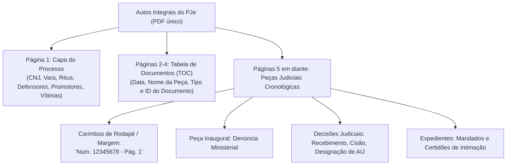

# JURISRESUMO — GUIA DE CONTEXTO FORENSE & ECONOMICIDADE OPERACIONAL (CONTEXT.md)

> **Documento Canônico de Contexto Jurídico, Engenharia de Autos e Eficiência de Recursos**  
> **Sistema:** JURISRESUMO — Síntese Automatizada de Processos Criminais PJe para Audiências  
> **Comarca / Tribunal:** Varas Criminais • Tribunal de Justiça do Estado do Rio Grande do Norte (TJRN)  
> **Autor e Desenvolvedor:** FChNeto  
> **Finalidade:** Fornecer contexto profundo de domínio e diretrizes rígidas de economicidade de tokens e processamento para agentes de IA e desenvolvedores.  

---

## 1. O Cenário de Negócio Forense (Varas Criminais do TJRN)

### 1.1. A Rotina Crítica do Magistrado em Sala de Audiência
Nas Varas Criminais da comarca de Natal e do interior do Estado do Rio Grande do Norte, o Magistrado e sua equipe de assessores realizam pautas diárias intensas de audiências. Em um único turno de trabalho (manhã ou tarde), podem ocorrer de **4 a 10 audiências** consecutivas.

Cada audiência possui natureza jurídica e rito procedimental próprios:
1. **Audiência de Instrução e Julgamento (AIJ - art. 400 do Código de Processo Penal):**
   - É o ato culminante da instrução criminal.
   - Ordem solene de oitiva: primeiro a vítima, em seguida as testemunhas de acusação (frequentemente policiais militares), as testemunhas de defesa e, por fim, o interrogatório do réu.
   - Qualquer inversão ou oitiva de testemunha não intimada/não arrolada acarreta nulidade processual absoluta.
   - O juiz precisa saber, no exato segundo em que abre a sala virtual ou chama a testemunha: quem é a pessoa, seu papel no fato (ex.: PM condutor, vítima, testemunha presencial), qual ID do mandado certificou sua intimação e se o réu está preso ou solto.
2. **Acordo de Não Persecução Penal (ANPP - art. 28-A do CPP):**
   - Não há instrução probatória, oitiva de testemunhas ou produção de provas.
   - Trata-se de ato solene de homologação judicial de acordo firmado entre o Ministério Público e o investigado/réu assistido por advogado ou defensor.
   - O juiz precisa aferir a voluntariedade do investigado, o montante da prestação pecuniária acordada, a destinação dos valores a entidades públicas ou sociais e as condições de reparação do dano e prestação de serviços à comunidade.
3. **Produção Antecipada de Provas (PAnP - art. 366 do CPP):**
   - Ocorre quando o réu, citado por edital, não comparece nem constitui advogado, suspendendo-se o processo e o curso do prazo prescricional.
   - O juiz pode determinar a produção antecipada de provas consideradas urgentes (ex.: depoimento de policiais militares ou testemunhas idosas/em risco).
4. **Audiência de Custódia (Resolução nº 213/2015 do CNJ):**
   - Realizada em até 24 horas após a comunicação do flagrante para análise da legalidade da prisão e necessidade de conversão em preventiva ou concessão de liberdade provisória.

### 1.2. O Papel do Resumo DOCX
O resumo gerado pelo **JURISRESUMO** não é uma peça burocrática; ele é o **radar ao vivo do magistrado**. O juiz mantém o documento aberto no Microsoft Word em uma tela secundária enquanto conduz a audiência no Microsoft Teams ou na sala de sessões.
- A clareza visual, as fontes legíveis (Verdana 12pt), as margens confortáveis (2,0 cm), os marcatextos cirúrgicos e os hiperlinks clicáveis permitem que o magistrado encontre qualquer informação em **menos de 3 segundos**.

---

## 2. Anatomia dos Autos Eletrônicos no PJe (TJRN)

Os autos processuais extraídos do sistema **Processo Judicial Eletrônico (PJe)** do TJRN constituem um único arquivo em formato PDF com centenas ou milhares de páginas. Compreender sua estrutura é essencial para garantir extrações cirúrgicas:



### 2.1. A Capa do Processo (Página 1)
- Contém o cabeçalho oficial do Poder Judiciário do RN.
- Apresenta os polos da ação penal:
  - **Autor:** Ministério Público do Estado do Rio Grande do Norte (ou querelante na ação privada).
  - **Réu(s):** Nome completo em caixa alta, situação prisional declarada e indicação de advogados particulares com OAB ou assistência pela Defensoria Pública do Estado.
  - **Vítima(s):** Relação dos sujeitos passivos da conduta criminosa.

### 2.2. A Tabela de Documentos (Catálogo TOC)
- Localizada logo após a capa (páginas 2 a 4).
- Lista todas as peças encartadas com 4 colunas principais:
  - **Data da Juntada:** Formato `DD/MM/AAAA HH:MM`.
  - **Documento:** Título descritivo da peça atribuído pelo juntador (ex.: `Denúncia`, `Decisão`, `Mandado Cumprido`).
  - **Tipo:** Categoria jurídica no PJe (ex.: `Petição Inicial`, `Despacho`, `Certidão`).
  - **ID:** Número binário de identificação unívoca no banco de dados do PJe (ex.: `172146861`).

### 2.3. Os Carimbos Marginais (`Num. <ID> - Pág. <P>`)
- No rodapé de cada página física dos autos do PJe é impresso o carimbo oficial:
  `Num. [ID] - Pág. [Número da folha interna daquela peça]`
- Este carimbo é a chave para correlacionar o texto da página ao respectivo documento do catálogo, permitindo isolar a denúncia ou a decisão judicial sem ler páginas alheias.

---

## 3. Guia de Economicidade de Recursos & Conservação de Tokens para Agentes de IA

Para agentes autônomos de IA e desenvolvedores que operam o JURISRESUMO, a **gestão parcimoniosa de contexto (tokens) e processamento** é uma diretriz de sobrevivência técnica e sustentabilidade financeira.

### 3.1. Princípio da Parcimônia de Contexto
Autos de processos criminais do TJRN frequentemente possuem entre **10 MB e 160 MB** (o caso real `Proc. 0821902-39`, por exemplo, possui mais de 148 MB e 850 páginas). 
- Injetar o texto integral desse arquivo na janela de contexto de um LLM consumiria centenas de milhares de tokens por requisição, gerando custos desnecessários, latências de até 2 minutos e altíssimo risco de alucinação (*needle in a haystack*).

```text
❌ ABORDAGEM INEFICIENTE (Desperdício de Tokens e Alto Custo):
[PDF Completo de 850 páginas / 150 MB] ───> [Prompt do LLM] ───> [Resumo Alucinado ou Timeout]

✅ ABORDAGEM JURISRESUMO (Economicidade Máxima & Alta Precisão):
[PDF do PJe]
     │
     ▼ (Processamento Local PyMuPDF / Regex - 0 Tokens de LLM)
[Leitura da Capa e TOC] ──> Localiza ID da Denúncia e ID do Despacho de Audiência
     │
     ▼ (Extração Cirúrgica de Apenas 6 a 12 Páginas)
[Fatos Relevantes Extraídos Localmente]
     │
     ▼ (Opcional - Apenas Denúncias Muito Extensas)
[Prompt Enxuto de 1.500 tokens] ───> [LLM Gemini] ───> [JSON Estruturado Preciso]
```

### 3.2. As 5 Regras de Ouro de Economicidade para Agentes

#### 🔹 Regra 1: Indexação Local Prévia (Zero Custo de Tokens)
- Sempre utilize o `pje_indexer.py` (ou a biblioteca client-side PDF.js) para processar localmente a Capa e o Catálogo TOC.
- Nunca faça requisição a LLMs para descobrir quais documentos existem no processo; essa informação já está estruturada matematicamente no catálogo das páginas 2 a 4.

#### 🔹 Regra 2: Triagem Cirúrgica de Páginas
- Ao necessitar da narrativa fática, extraia **estritamente as páginas delimitadas pelo ID da Denúncia Ministerial**.
- Ao necessitar do histórico processual, extraia apenas as linhas de decisões, mandados e certidões presentes no índice de documentos, sem varrer o texto integral de cada certidão intermediária.

#### 🔹 Regra 3: Delimitação Rígida por Tokens de Parada (*Early Termination*)
- Em 99% das denúncias do Ministério Público, os fatos estão compreendidos entre a frase inaugural (`Consta dos autos que...` / `DOS FATOS`) e o início das seções formais (`DO PEDIDO`, `ROL DE TESTEMUNHAS`, `COTA`).
- O leitor deve interromper a ingestão imediatamente ao encontrar esses delimitadores, economizando o processamento de dezenas de páginas secundárias.

#### 🔹 Regra 4: Saída em Esquema Tipado (JSON Pydantic)
- Ao solicitar síntese fática para a IA generativa, exija a resposta no formato estruturado do schema `HearingSummaryData`.
- Esquemas rígidos impedem que o modelo gaste tokens de saída com explicações prolixas, preâmbulos ou saudações desnecessárias.

#### 🔹 Regra 5: Inspeções de Código Cirúrgicas no Workspace
- Ao auditar ou debugar código, o agente de IA deve utilizar `grep_search` focado e `view_file` delimitado a intervalos de 50 a 100 linhas.
- Despejar arquivos de 2.000 linhas repetidas vezes na janela de conversa satura a memória do agente e degrada a capacidade de raciocínio.

#### 🔹 Regra 6: Decisão Estruturada JEV (System One) e Descarte Leya
- Utilizar o classificador determinístico e probabilístico `JEVDecisionEngine` (System One) para pontuar a relevância de peças (0.0 a 1.0) antes de incorporá-las ao histórico ou à narrativa fática.
- Descartar cirurgicamente comprovantes bancários, guias de custas judiciais, autenticações mecânicas, certidões avulsas de triagem e carimbos marginais do PJe, garantindo 0% de ruído e blindagem contra alucinações.

---

## 4. Topologia e Organização Física do Repositório

O workspace está organizado de forma limpa e modular:

```text
c:\Users\f201503\Documents\Resumo para audiência\
│
├── ABRIR_APLICATIVO_DIRETO.html       <- Versão JS standalone direta na raiz
├── ABRIR_VERSAO_JAVASCRIPT.html       <- Atalho redirecionador para versao_javascript/
├── ABRIR_VERSAO_PYTHON.vbs            <- Inicializador silencioso do Eel/Python sem tela preta
├── Iniciar_JURISRESUMO.vbs            <- Inicializador silencioso clássico
├── index.html                         <- Espelho funcional da versão JS nativa
├── run.py                             <- Lançador universal (Eel desktop ou FastAPI server)
├── run_eel.py                         <- Módulo de desktop nativo via Edge (--app)
├── recovery.py                        <- Gerenciador canônico de checkpoints e restauração
├── requirements.txt                   <- Dependências Python (FastAPI, PyMuPDF, Eel, etc.)
│
├── AGENTS.md                          <- Matriz de governança dos 7 agentes especializados
├── ROADMAP.md                         <- Linha do tempo, versões históricas e rotas futuras
├── CONTEXT.md                         <- Este documento de contexto e economicidade
├── MEMORY.md                          <- Histórico canônico dos atos e síntese global
│
├── versao_javascript/                 <- PASTA ISOLADA: Aplicação JS 100% Autônoma
│   ├── ABRIR_APLICATIVO_DIRETO.html
│   ├── index.html
│   └── vendor/                        <- PDF.js e JSZip locais (sem CDN)
│
├── versao_python/                     <- PASTA ISOLADA: Aplicação Python Completa
│   ├── run.py
│   ├── run_eel.py
│   ├── app/
│   │   ├── api/routes.py              <- Rotas FastAPI REST
│   │   ├── core/                      <- Models Pydantic, Indexer PJe, OCR
│   │   ├── engines/                   <- OfflineEngine e GeminiEngine
│   │   ├── generators/docx_generator.py <- Construtor Word OpenXML Mined
│   │   └── static/                    <- Frontend Google Stitch com CSS embutido
│   └── tests/                         <- Suíte completa de 179 testes Pytest
│
└── gitpost/                           <- PASTA DE RELEASE E REPOSITÓRIO GITHUB
    ├── (Estrutura idêntica para publicação pública sob autoria de FChNeto)
    └── .git/                          <- Conectado a https://github.com/Chneto/jurisresumo
```

---

## 5. Diretrizes Inegociáveis de Conformidade Judicial

1. **Fidelidade à Denúncia:** Nunca altere a narrativa acusatória ministerial com termos próprios ou julgamentos de mérito. O juiz necessita ler exatamente o que o Ministério Público imputou ao acusado.
2. **Histórico em Texto Regular:** O padrão oficial do TJRN exige que as datas e descrições do histórico sejam em fonte regular, **sem negrito**. Negrito é reservado exclusivamente a títulos de seção, cabeçalho de partes e nomes de acusados.
3. **Hiperlinks Operacionais:** Todo ID citado deve ser clicável e abrir a folha correspondente no PJe.
4. **Respeito ao Rito do ANPP:** Audiências de ANPP dispensam e proíbem o carregamento de Qualificação, Imputação, Histórico longo e Rol de Testemunhas, devendo focar exclusivamente nos 6 parágrafos analíticos de referência.

---

**JURISRESUMO — Eficiência, Segurança e Precisão a serviço do Poder Judiciário.**  
**Desenvolvido por FChNeto**

---

## 6. Estado Atual do Sistema (2026-09-29 • Versão 2.8)

### 6.1. Status Operacional das Versões

| Componente | Status | Observações |
|---|---|---|
| **Versão Python (FastAPI/Eel)** | ✅ Operacional | 195 testes Pytest com 100% de aprovação. JEV/Leya/OCR calibrados. Qualificação completa ativa. |
| **Versão JavaScript (Zero-Install)** | ✅ Operacional | SyntaxError crítico corrigido em 8 arquivos. Dropzone HTML restaurado. `validateFile()` implementada. |
| **Motor Offline (Heurístico JS/Python)** | ✅ Operacional | Hierarquia jurídica penal estrita (PAnP → ANPP → AIJ → Custódia). Leitura 100% do PDF. |
| **Motor IA (Gemini API)** | ✅ Disponível | `gemini-2.5-flash` e `gemini-2.5-pro` com schema JSON rígido via Pydantic. |
| **Preview A4 Contínuo** | ✅ Corrigido | `align-items: flex-start` + `min-height: 29.7cm; height: auto !important;` ativos em todas as versões. |
| **Gerador DOCX (OpenXML)** | ✅ Operacional | Verdana 12pt, margens 2,0cm, entrelinhas 1,89, marcatexto estrito, hiperlinks PJe clicáveis. |
| **Upload e Dropzone JS** | ✅ Restaurado | `<form>` mal-aninhado removido; `name='file'` adicionado; `<div id='upload-error'>` e `validateFile()` ativos. |

### 6.2. SyntaxError JS — Resolvido em 2026-09-29

O SyntaxError crítico identificado na versão JavaScript — que abortava silenciosamente **todo** o motor JS antes de registrar qualquer event listener — foi corrigido com sucesso:

- **Causa:** Chave `}` ausente no bloco `if (/denúncia|denuncia|queixa-crime|petição inicial/i.test(...))` (~linha 1742 do `index.html`).
- **Efeito anterior:** Nenhum botão respondia, upload não processava, geração de DOCX era inoperante.
- **Correção:** Inserção da `}` faltante e restauração do equilíbrio de blocos em todos os 8 arquivos afetados.
- **Verificação:** Abrir `versao_javascript/index.html` no navegador → F12 → Console → zero erros. Testar upload com PDF válido e com arquivo não-PDF.

### 6.3. Checkpoint Ativo

```
ID: 20260929_112752_js-syntax-fix-complete
Rótulo: js-syntax-fix-complete
Descrição: Correção crítica do SyntaxError JS, restauração do dropzone e validação client-side de upload.
Restauração: python recovery.py restore 20260929_112752_js-syntax-fix-complete
```

**Autor e Desenvolvedor: FChNeto**
