# JURISRESUMO — ROADMAP ESTRATÉGICO & EVOLUÇÃO TECNOLÓGICA (ROADMAP.md)

> **Documento Canônico de Escopos, Rotas Evolutivas e Próximos Passos**  
> **Sistema:** JURISRESUMO — Síntese Automatizada de Processos Criminais PJe para Audiências  
> **Comarca / Tribunal:** Varas Criminais • Tribunal de Justiça do Estado do Rio Grande do Norte (TJRN)  
> **Autor e Desenvolvedor:** FChNeto  
> **Estado Atual:** Versão 3.0 (100% Validada • Resposta à Acusação Inominada • Deduplicação de Testemunhas Comuns • 207 Pytests)  

---

## 1. Visão Geral e Filosofia do Projeto

O **JURISRESUMO** nasceu da necessidade prática vivenciada no cotidiano forense das Varas Criminais do TJRN: a preparação ágil, profunda e precisa das audiências de Instrução e Julgamento (AIJ), Acordos de Não Persecução Penal (ANPP), Produção Antecipada de Provas (PAnP) e Audiências de Custódia.

O projeto orienta-se por **quatro pilares inegociáveis**:
1. **Soberania e Privacidade Absoluta (Motor 100% Offline):** O usuário deve ser capaz de operar a ferramenta em ambiente isolado, sem necessidade de internet, protegendo os dados sensíveis dos réus e das vítimas.
2. **Poder Analítico Opcional (Motor IA Gemini):** Suporte opcional à inteligência artificial generativa de ponta para sintetizar denúncias extensas de crimes societários ou organizações criminosas.
3. **Fidelidade Tipográfica Estrita (Engenharia OpenXML Mined):** Cada documento `.docx` gerado replica rigorosamente o padrão visual do gabinete do magistrado (Verdana 12pt, margens 2,0cm, entrelinhas 1,89, realces verde/amarelo pontuais e hiperlinks azuis do PJe).
4. **Zero Fricção Operacional:** Disponibilização de versão portátil nativa em JavaScript (abre com 2 cliques em qualquer navegador sem instalação) e versão desktop em Python com Eel (sem terminal preto do CMD).

---

## 2. Linha do Tempo e Retrospectiva das Releases

```mermaid
timeline
    title Evolução Histórica do JURISRESUMO
    section 2026-Q3 : v1.0 Baseline : Ingestão PyMuPDF + FastAPI + DOCX Inicial
                    : v2.0 Portátil : Versão JS Zero-Install + Menu Hambúrguer + Dual Scroll
                    : v2.1 Marcatexto : Realce Verde Estrito (Réus:) + Amarelo Seções
                    : v2.2 Leitura Total : Leitura 100% PDFs + Distinção AIJ vs ANPP + Fatos Fiéis
                    : v2.3 Vendor Local : PDF.js e JSZip offline sem CDNs
                    : v2.4 Desacoplamento : Separação versao_python / versao_javascript + JS Analítico
                    : v2.5 Folha Contínua & Eel : align-items flex-start + CSS Embutido + Desktop Eel + GitHub
                    : v2.6 OCR/JEV/Leya : Recalibração OCR + Classificador JEV + Filtro Leya + Google Stitch
                    : v2.7 Qualificação & LGPD : Qualificação Completa + Filtro Anti-Órgãos + JEV Adaptativo
                    : v2.8 Fix Crítico JS : SyntaxError Corrigido (8 Arquivos) + Dropzone HTML + validateFile()
                    : v2.9 Qualif/Imputação Rígida : 9 Atributos + Multi-Artigos + Auditoria JEV + 199 Testes
                    : v3.0 Resposta Inominada & Testemunhas : Detecção Textual Resposta à Acusação + Deduplicação Rol + 207 Testes
    section Futuro : v3.1 PJe Direct & Busca : P&R Semântico nos Autos + Suporte Cível/Família
                   : v4.0 Audiência ao Vivo : Transcrição em Tempo Real + Termo de Audiência Automático
```

---

### Detalhamento das Versões Concluídas

#### 📦 Versão 1.0 — Baseline Funcional Aprovada
- Ingestão de autos do PJe via PyMuPDF e extração de texto em Python.
- Motor de regras para identificação de réus, testemunhas e histórico com IDs.
- Backend estruturado em FastAPI com servidor Uvicorn.
- Geração de documento Word `.docx` com estilos OpenXML iniciais.

#### 📦 Versão 2.0 — Versão Portátil Zero-Install & Interface Google Stitch
- Criação de `ABRIR_APLICATIVO_DIRETO.html` para operação em qualquer dispositivo sem Python.
- Introdução da identidade visual **Google Stitch & Nano Banana** (cards escuros e paleta `#facc15`).
- Rolagem dupla independente (*dual scroll*): painel de edição e folha de pré-visualização desacoplados.
- Criação do menu hambúrguer lateral (`☰`) com opções de configuração e rascunhos.
- Implementação do inicializador silencioso `Iniciar_JURISRESUMO.vbs` sem tela preta.
- Fixação da autoria perene de **FChNeto**.

#### 📦 Versão 2.1 — Padronização Estrita de Marcatexto Forense
- Mineração aprofundada dos estilos XML dos 9 processos de referência do magistrado.
- Padronização do realce verde (`w:highlight w:val="green"`): quando há múltiplos réus, **apenas** o cabeçalho `Réus:` é destacado; itens individuais permanecem em texto regular.
- Réu único recebe linha inteira verde com ID em azul sublinhado.
- Títulos de seções principais em amarelo (`w:val="yellow"`) e corpo sem realce.
- Nota defensiva de testemunhas destacada em negrito e amarelo.

#### 📦 Versão 2.2 — Leitura Integral dos Autos & Distinção Jurídica AIJ vs ANPP
- Eliminação de podas cegas de páginas no indexador do PJe: leitura completa dos documentos.
- Resolução da confusão de atos: priorização de despachos judiciais recentes que designaram Instrução e Julgamento (AIJ), mesmo quando havia menção pretérita a ANPP.
- Preservação da narrativa fática ministerial integral (~99% dos casos).
- Datas do cabeçalho formatadas por extenso com horário (`24 de julho de 2026 às 11h00min`).

#### 📦 Versão 2.3 — Autonomia Total JavaScript com Bibliotecas Locais
- Download e congelamento das dependências essenciais na pasta `vendor/` (`pdf.min.js`, `pdf.worker.min.js`, `jszip.min.js`).
- Execução 100% offline em navegadores sem depender de requisições a CDNs externas e sem bloqueios de CORS.

#### 📦 Versão 2.4 — Desacoplamento Físico de Pastas & Motor JS Analítico
- Separação física estrutural do projeto em dois ecossistemas independentes:
  - `versao_python/`: Backend completo FastAPI, Uvicorn, OCR, PJe Indexer e suíte de 179 testes.
  - `versao_javascript/`: Versão portátil completa cliente-side em HTML5/JS/CSS.
- **Reconstrução Analítica do Motor JS:**
  - Extração de texto por coordenadas (eixos X e Y) no PDF.js, preservando estrutura tabular.
  - Leitura do catálogo TOC e correlação com carimbos marginais `Num. <ID> - Pág. <P>`.
  - Suporte completo a caracteres acentuados maiúsculos (`FRANÇA`, `FÁTIMA`, `LÚCIA`, `JOSÉ`, `ÂNGELO MÁRCIO`).
  - Estruturação canônica de ANPP em 6 parágrafos reais, sem dados mockados.

#### 📦 Versão 2.5 — Folha A4 Contínua no Preview, Desktop Eel & Publicação GitHub
- **Resolução do Fundo Azul no Preview:** Aplicação de `align-items: flex-start` no `.desk-scroller` e `min-height: 29.7cm; height: auto !important;` na `.word-paper-sheet`, garantindo que a folha expanda continuamente por quantas páginas forem necessárias, mantendo o fundo `#ffffff` e margens de 2,0 cm até o encerramento formal.
- **Frontend Python Blindado:** Inclusão de 1.142 linhas do design system Google Stitch & Nano Banana diretamente no `<style>` do `index.html`, prevenindo renderização desformatada.
- **Integração Desktop Nativa com Eel (`run_eel.py`):** Lançamento em modo de aplicativo dedicado do Microsoft Edge (`--app`), sem barras de endereço, sem abas e com alta performance de comunicação local.
- **Publicação Rastreável no GitHub:** Repositório sincronizado e publicado no GitHub ([https://github.com/Chneto/jurisresumo](https://github.com/Chneto/jurisresumo)) sob autoria de `FChNeto`.

#### 📦 Versão 2.6 — Recalibração OCR/Tesseract, Mecanismos JEV & Leya e Google Stitch UI ✅ CONCLUÍDO
- **Recalibração do Motor OCR/Tesseract:** Pré-processamento visual de alta fidelidade (escala de cinza, autocontraste dinâmico, realce de contraste 1.6x, sharpening e limiarização Otsu adaptativa) e margens proporcionais dinâmicas (5.5% superior e 7.5% inferior), neutralizando carimbos marginais sem decepar o texto.
- **Classificador Estruturado JEV (System One Model):** Implementação de decisões discretas tipadas com pontuação probabilística de relevância (0.0 a 1.0) para roteamento preciso de peças fundamentais.
- **Filtro de Descarte Leya:** Rejeição rigorosa de comprovantes de pagamento bancário, guias de recolhimento de custas, autenticações mecânicas, certidões puramente ordinatórias de triagem e ruídos de digitalização.
- **Harmonização Google Stitch:** Barra de progresso multifásica com 4 microestados dinâmicos e Smart Badge com pulso suave no cabeçalho.
- **Cobertura de 189 Testes Automatizados:** Suíte Pytest ampliada para 189 testes com 100% de aprovação.

#### 📦 Versão 2.7 — Qualificação Completa, Filtro Anti-Órgãos Estatais, Máscara e Cronologia, Fatos sem Vocativos, Higienização LGPD e JEV Adaptativo ✅ CONCLUÍDO
- **Filtro Anti-Órgãos Estatais (`STATE_ORGANS_BLACKLIST_REGEX`):** Elimina entidades governamentais erroneamente cadastradas no polo passivo pelo PJe.
- **Qualificação Completa e Estruturada:** Extrai filiação, RG, CPF, data de nascimento, naturalidade e endereço de cada acusado.
- **Máscara Estrita `DD/MM/AA`** e **Ordenação Cronológica Crescente** do histórico processual.
- **Supressão Cirúrgica de Vocativos** na narrativa fática ministerial.
- **Higienização LGPD no Repositório GitHub:** Remoção de testes com autos reais e anonimização da documentação pública.
- **Motor JEV/LEYA Adaptativo:** Módulo `LearningStore` com feedback loop local (195 testes, 100% aprovados).

#### 📦 Versão 2.8 — Correção Crítica de SyntaxError JS, Restauração do Dropzone e Validação Client-Side de Upload ✅ CONCLUÍDO (29/09/26)
- **Investigação e Identificação do SyntaxError:** DeepInvestigator identificou uma `}` ausente no bloco `if (/denúncia|.../)` da função de extração cronológica (~linha 1742), que abortava silenciosamente todo o JavaScript antes de qualquer event listener ser registrado.
- **Correção em 8 Arquivos Simultâneos:** `versao_javascript/index.html`, `versao_javascript/ABRIR_APLICATIVO_DIRETO.html`, `ABRIR_APLICATIVO_DIRETO.html` (raiz), `index.html` (raiz) e 4 cópias em `gitpost/`. Balanceamento de chaves diff=0 confirmado em todos.
- **Restauração da Estrutura HTML do Dropzone:** Remoção do `<form enctype='multipart/form-data'>` mal-aninhado dentro da `.top-action-bar`; fechamento correto da div restaurado.
- **Adição de `name='file'` e `<div id='upload-error'>`:** Conformidade HTML5 e receptor dedicado de mensagens de validação client-side.
- **Implementação da Função `validateFile()`:** Guarda-chuva de validação integrado aos handlers `ondrop` e `onchange` com mensagem `'Formato de arquivo inválido. Por favor, envie apenas PDFs.'` e auto-ocultação em 5 segundos.
- **Checkpoint de Recovery:** `20260929_112752_js-syntax-fix-complete`.

#### 📦 Versão 2.9 — Extração Rígida e Literal de Qualificação e Imputação Penal Ampla ✅ CONCLUÍDO (30/09/26)
- **Qualificação Multilinha Completa:** Fim dos cortes em `;` e `\n`, garantindo a captura padronizada dos 9 atributos (Nome, Nacionalidade, Estado Civil, Profissão, Data de Nascimento/Idade, Naturalidade, Filiação materna e paterna, RG com órgão/UF, CPF, Endereço Domiciliar e Telefone).
- **Fallback Automático no Inquérito Policial:** Resgate automático de filiação e documentos a partir dos termos de interrogatório policial quando a denúncia for omissa.
- **Imputação Penal Global Multi-Artigos:** Varredura exaustiva de todos os artigos (`art.`), parágrafos (`§`), incisos, leis especiais (Lei de Drogas, Estatuto do Desarmamento, ECA, Maria da Penha) e concursos de crime (arts. 69, 70 e 71 do CP).
- **Auditoria Determinística no JEV Decision Engine (`jev_decision_engine.py`):** Método `audit_qualification_and_imputation()` que audita a integridade de dados e complementa omissões automaticamente.
- **Imperativo Rígido no Gemini Prompt:** Diretriz estrita vetando qualquer sumarização de qualificação ou tipos penais.
- **199 Testes no Pytest com 100% de Aprovação:** Suíte ampliada com `test_rigid_qualif_imputation.py` e publicação sincronizada no GitHub (`commit a1d0571`).
- **Checkpoint de Recovery:** `20260930_100323_v2_9-qualif-imputacao-rigida`.

#### 📦 Versão 3.0 — Detecção de Resposta à Acusação Inominada & Deduplicação de Testemunhas Comuns ✅ CONCLUÍDO (30/09/26)
- **Varredura Textual de Peças Inominadas:** Identificação e síntese de respostas à acusação protocoladas sob nomes genéricos no PJe ("Petição", "Manifestação", "Contestação", "Documento Diverso"), resgatando ID, data, patrono e pedidos defensivos.
- **Deduplicação de Testemunhas Comuns:** Unificação inteligente de testemunhas arroladas por ambas as partes com rotulagem composta precisa (`arrolada por todos`, `arrolada pelo MP e pela Defensoria`, `arrolada pelo MP e pela Defesa de [Réu] - Dr. [Advogado]`).
- **Paridade Python / JavaScript:** Lógica idêntica sincronizada nos motores Python e nos pacotes HTML portáteis (`index.html`).
- **207 Testes Automatizados no Pytest:** Suíte expandida com `test_unnamed_defense_and_witness_merge.py` aprovada com 100% de sucesso.
- **Publicação no GitHub:** Sincronização e commit `791296c` no repositório oficial.

---


## 3. Rotas Evolutivas e Próximos Passos

```mermaid
graph LR
    subgraph CurtoPrazo["Curto Prazo (v2.6)"]
        B1["Processamento em Lote<br/>(Pauta de Audiências)"]
        B2["Templates Customizáveis<br/>por Gabinete"]
        B3["Detecção Aprofundada<br/>de Contrafé Positiva/Negativa"]
        B4["Suporte Experimental<br/>a LLMs Locais (Ollama)"]
    end

    subgraph MedioPrazo["Médio Prazo (v3.0)"]
        M1["Integração Direta PJe<br/>(Certificado Digital)"]
        M2["Busca Semântica & QA<br/>nos Autos Volumosos"]
        M3["Suporte a Audiências<br/>Cíveis e de Família"]
        M4["Empacotamento Executável<br/>Único (.exe) para Windows"]
    end

    subgraph LongoPrazo["Longo Prazo (v4.0)"]
        L1["Assistente de Audiência ao Vivo<br/>(Transcrição em Tempo Real)"]
        L2["Minuta Automática do<br/>Termo de Audiência"]
        L3["Painel Unificado para<br/>Chefes de Secretaria"]
    end

    CurtoPrazo --> MedioPrazo --> LongoPrazo
```



---

### 3.1. Versão 2.9 — Testes E2E do Upload, Nomeação DOCX e README da Versão JS (Próximo Passo Imediato)

1. **Testes E2E do Upload na Versão JavaScript:**
   - *Demanda:* Validação automatizada do fluxo completo de upload na versão portátil — desde o `ondrop`/`onchange` até o processamento PDF.js e geração do DOCX.
   - *Funcionalidade:* Testes que cubram: arquivo PDF válido aceito, arquivo não-PDF rejeitado com mensagem correta, arquivo vazio rejeitado, e geração de DOCX ao final do pipeline.
2. **Verificação da Nomeação do DOCX (`Resumo_{numero}_{tipo}.docx`):**
   - *Demanda:* Garantir que o arquivo gerado pelo motor JS receba o nome padronizado `Resumo_{numero_processo}_{tipo_audiencia}.docx`, e não `resumo.docx` genérico.
   - *Funcionalidade:* Extração do número CNJ do processo e do tipo de ato (AIJ/ANPP/PAnP/Custódia) para composição do nome de download.
3. **Atualização do README da Versão JS (`versao_javascript/README.md`):**
   - *Demanda:* O README da versão JS está desatualizado e não documenta: o SyntaxError corrigido, a estrutura do dropzone, a função `validateFile()` e o procedimento de verificação (F12 → Console).
   - *Funcionalidade:* Revisão e publicação do `versao_javascript/README.md` com seção de Changelog v2.8, instruções de uso e seção "Como Verificar a Saúde do Motor JS".

---


### 3.2. Versão 3.0 — Conectividade PJe & Expansão de Competências (Médio Prazo)

1. **Integração Direta com o Sistema PJe (TJRN):**
   - *Demanda:* Dispensa do download manual prévio de PDFs pesados.
   - *Funcionalidade:* Extensão de navegador (Chrome/Edge) ou conector local que, ao estar autenticado no PJe, extrai diretamente o número do processo, pauta da sala virtual e baixa os autos de forma transparente.
2. **Busca Semântica & Perguntas e Respostas sobre os Autos (Chat with Case):**
   - *Demanda:* Durante a oitiva de uma testemunha em audiência, o juiz precisa conferir um detalhe específico ("A testemunha afirmou na delegacia que a arma era preta ou prateada?", "Qual o valor do prejuízo atestado pela vítima?").
   - *Funcionalidade:* Chat local indexado via embeddings locais (ChromaDB / SQLite-VSS) que responde em menos de 2 segundos com o ID da folha exata.
3. **Expansão para Varas Cíveis, de Família e Fazenda Pública:**
   - *Demanda:* Adaptação do motor para audiências de conciliação/mediação, audiências de alimentos e instrução cível, com mapeamento de petição inicial, contestação e despacho saneador.
4. **Empacotador Executável Standalone (.exe) para Windows:**
   - *Demanda:* Geração de um arquivo executável único assinado via PyInstaller ou Nuitka, eliminando a dependência do Python instalado para o modo desktop completo.

---

### 3.3. Versão 4.0 — Assistente de Audiência em Tempo Real (Longo Prazo)

1. **Transcrição de Voz em Tempo Real no Tribunal:**
   - *Demanda:* Captura do áudio do microfone da audiência (Teams/Meet ou microfone de sala física) com transcrição automática local (via Whisper/faster-whisper) separando os oradores (Juiz, Ministério Público, Defesa, Testemunha, Réu).
2. **Redação Concomitante do Termo de Audiência:**
   - *Demanda:* Enquanto a audiência se desenrola, o sistema estrutura o Termo de Deliberações e Despachos (requerimentos das partes, deferimento de diligências e designação de prazo para alegações finais em memoriais).

---

## 4. Matriz de Priorização de Demandas (Impacto vs. Esforço)

| Iniciativa / Funcionalidade | Impacto no Gabinete | Esforço Técnico | Horizonte | Prioridade |
|---|---|---|---|---|
| **Correção Folha A4 Contínua** | Altíssimo | Concluído | v2.5 | Entregue |
| **Frontend CSS Embutido & Eel** | Altíssimo | Concluído | v2.5 | Entregue |
| **Publicação no GitHub** | Alto | Concluído | v2.5 | Entregue |
| **Recalibração OCR/JEV/Leya** | Altíssimo | Concluído | v2.6 | Entregue |
| **Qualificação Completa & LGPD** | Altíssimo | Concluído | v2.7 | Entregue |
| **Fix SyntaxError JS (8 arquivos)** | Altíssimo | Concluído | v2.8 | Entregue ✅ |
| **Restauração HTML Dropzone** | Altíssimo | Concluído | v2.8 | Entregue ✅ |
| **Validação Client-Side (`validateFile()`)** | Alto | Concluído | v2.8 | Entregue ✅ |
| **Testes E2E Upload JS** | Altíssimo | Baixo | v2.9 | **P1 (Imediata)** |
| **Nomeação DOCX Padronizada** | Alto | Baixo | v2.9 | **P1 (Imediata)** |
| **Atualização README Versão JS** | Médio | Baixo | v2.9 | **P1 (Imediata)** |
| **Busca Semântica / Chat nos Autos** | Altíssimo | Alto | v3.0 | **P3 (Futura)** |
| **Conector Direto ao PJe TJRN** | Altíssimo | Alto | v3.0 | **P3 (Futura)** |
| **Assistente de Audiência ao Vivo** | Revolucionário | Altíssimo | v4.0 | **P4 (Visão)** |


---

## 5. Log de Dívidas Técnicas & Mitigações Ativas

| Área | Dívida Técnica Identificada | Risco Associado | Mitigação Atual / Planejada |
|---|---|---|---|
| **Arquivos Grandes (> 150 MB)** | Autos com centenas de páginas digitalizadas podem consumir memória RAM expressiva durante o OCR. | Lentidão em máquinas antigas de gabinetes judiciais. | Extração sob demanda: apenas páginas de documentos não textuais passam por OCR; processamento concorrente liberando memória imediatamente. |
| **Duplicação de Código (Py / JS)** | Algumas heurísticas de regex existem tanto em Python (`offline_engine.py`) quanto em JS (`index.html`). | Divergência de comportamento entre versões ao modificar regex. | Teste de paridade automatizado (`test_js_engine_parity.py`) e validação cruzada contínua nos 9 processos de teste. |
| **Dependência de Edge no Eel** | O Eel depende da presença de um navegador baseado em Chromium (Edge ou Chrome) no Windows. | Falha ao abrir em computadores com navegadores não padrão. | O `run.py` e `run_eel.py` possuem detecção em cascata (Edge $\rightarrow$ Chrome $\rightarrow$ Navegador padrão $\rightarrow$ Fallback para servidor FastAPI). |

---

**JURISRESUMO — Construído para servir com excelência à Justiça Criminal do Rio Grande do Norte.**  
**Autor e Responsável Técnico: FChNeto**
